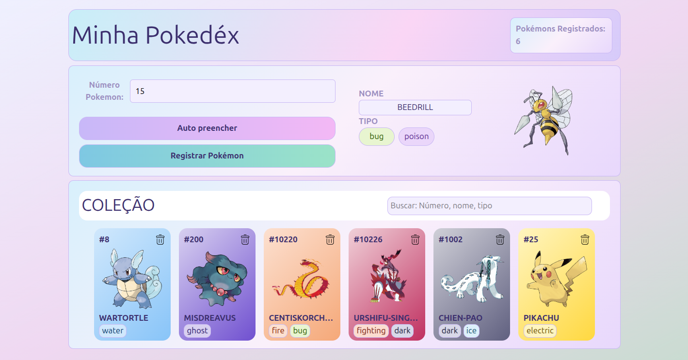

# 🗺️ Minha Pokédex

Uma aplicação web interativa desenvolvida em **React** com **Vite**, projetada para permitir que os usuários busquem informações de Pokémons em tempo real, visualizem seus detalhes e gerenciem uma coleção personalizada com persistência de dados local.

Este projeto foi desenvolvido com o objetivo prático de consolidar conceitos de manipulação de estados, ciclo de vida de componentes, renderização condicional, modularização de estilos com Sass e persistência no ecossistema Frontend.

## Deploy da aplicação: https://pokedex-react-vite.vercel.app/

---

---

## 🚀 Funcionalidades

- **Busca por ID:** Permite consultar Pokémons individuais inserindo o número correspondente, o programa inicia informando que não tem pokemon pesquisado, caso o usuário digite um número não correspondente é retornado a mensagem de que o Pokémon não foi encontrado.
- **Auto Preencher / Exibição em Tempo Real:** Renderiza dinamicamente o nome, imagem oficial e os tipos do Pokémon pesquisado.
- **Gerenciamento de Coleção:** 
  - Adiciona Pokémons à coleção com validação de duplicatas (evita registrar o mesmo Pokémon duas vezes).
  - Feedback visual temporário de 2 segundos indicando o sucesso na adição da coleção ou se o Pokémon já existe na coleção.
  - Remoção de Pokémons da coleção através do ícone de lixeira em cada card.
  - Busca do Pokémon na coleção por número, nome e tipo.
- **Estilização Dinâmica:** As cores de fundo dos cards e das tags de tipo se adaptam automaticamente baseadas no tipo principal (primeiro tipo) do Pokémon.
- **Contador Dinâmico:** O cabeçalho exibe em tempo real a quantidade total de Pokémons salvos.
- **Persistência no LocalStorage:** A coleção é mantida salva no navegador do usuário, sendo recuperada automaticamente a cada nova sessão ou recarregamento da página.

---

## 🛠️ Tecnologias Utilizadas

| Tecnologia | Finalidade / Aplicação no Projeto |
| :--- | :--- |
| **Vite + React** | Ambiente de desenvolvimento ultra-rápido e biblioteca base para construção da UI baseada em componentes. |
| **SCSS Modules** | Modularização de estilos por componente, garantindo escopo fechado e evitando vazamento de regras CSS. |
| **Sass (_mixins / _variaveis)** | Uso de pré-processador para reaproveitamento de variáveis globais e mixins estruturais. |
| **Tailwind CSS** | Utilizado de forma pontual e minimalista para configurações de estilos globais na raiz (`index.css`). |
| **HTML5 / JavaScript ES6+** | Estruturação semântica e lógica de manipulação de arrays e objetos. |

---
## 🧠 Detalhes Técnicos de Implementação
Estado Centralizado e Props: O estado da lista de Pokémons (colecao) reside no componente pai App.jsx. Já o GetPokemomApi distribui os dados e as funções de manipulação (como adicionar e deletar) para os componentes filhos estritamente via props.

Inicialização de Estado Inteligente: Ao carregar a aplicação, o useState do App.jsx realiza uma verificação direta no localStorage. Caso existam dados prévios, eles inicializam a coleção; caso contrário, inicia-se um array vazio.

Mapeamento de Cores via CSS Inline: Para contornar as limitações de classes estáticas, as cores dos cards e dos tipos são injetadas dinamicamente via atributos de estilo em linha (style={...}), consumindo dicionários de dados estruturados em objetos Javascript localizados na pasta utils/.

Renderização Condicional de Tipos: A interface analisa o tamanho do array de tipos de cada Pokémon. Se houver apenas um tipo, renderiza uma única tag; se houver dois, mapeia e renderiza ambos sem quebrar o layout.

---

## 📂 Arquitetura e Estrutura de Pastas

O projeto adota uma estrutura modularizada e limpa, dividindo responsabilidades por componentes e arquivos utilitários:

```text
POKEDEX_REACT_VITE/
├── src/
│   ├── components/
│   │   ├── cabecalho/         # Componente do topo (Título e Contador de registros)
│   │   │   ├── Cabecalho.jsx
│   │   │   └── Cabecalho.module.scss
│   │   ├── captura/           # Área de busca e ações de registro do Pokémon
│   │   │   ├── GetApiPokemon.jsx
│   │   │   └── GetApiPokemon.module.scss
│   │   └── colecao/           # Grid que renderiza os cards dos Pokémons salvos
│   │       ├── Colecao.jsx
│   │       └── Colecao.module.scss
│   ├── icons/                 # Arquivos de vetores e assets visuais
│   │   └── trash_icon.svg
│   ├── sass/                  # Configurações globais de estilo do pré-processador
│   │   ├── _mixins.scss
│   │   └── _variaveis.scss
│   ├── utils/                 # Objetos de mapeamento de cores hexadecimais por tipo
│   │   ├── coresCardsTipos.jsx
│   │   └── tipoCores.jsx
│   ├── App.css
│   ├── App.jsx                # Componente central (Guarda o estado global e gerencia o LocalStorage)
│   ├── index.css
│   └── main.jsx
├── eslint.config.js
├── package.json
└── vite.config.js
```
---


## 📦 Como Executar o Projeto
Certifique-se de ter o Node.js instalado em sua máquina. O projeto utiliza o gerenciador de pacotes pnpm (conforme arquivos de lock), mas você também pode usar npm ou yarn.

```bash
# 1. Clone este repositório
$ git clone git@github.com:dvbcknd/Pokedex-React-Vite.git

# 2. Acesse a pasta do projeto
$ cd Pokedex-React-Vite

# 3. Instale as dependências necessárias
$ pnpm install
# ou se preferir: npm install

# 4. Inicie o servidor de desenvolvimento local
$ pnpm dev
# ou se preferir: npm run dev
```
Após iniciar o servidor, abra o navegador e acesse o endereço local informado no terminal (geralmente http://localhost:5173).

---

## Autor
Bruno Gomes - https://www.linkedin.com/in/dvbcknd/
